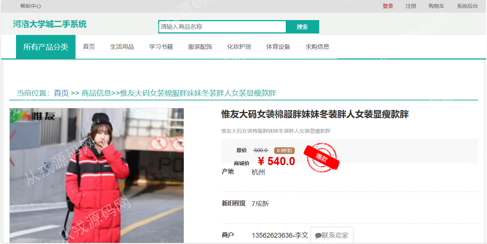
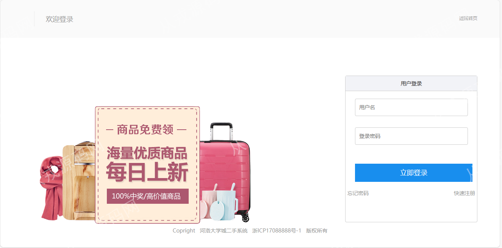
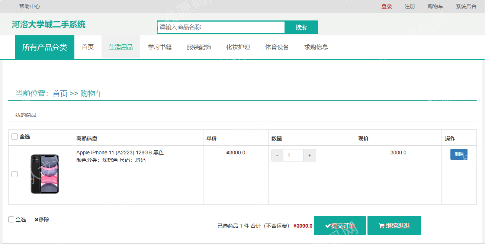
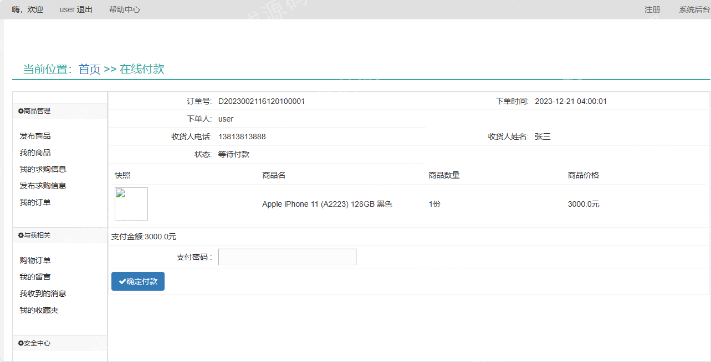
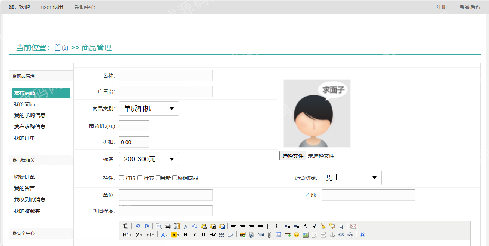
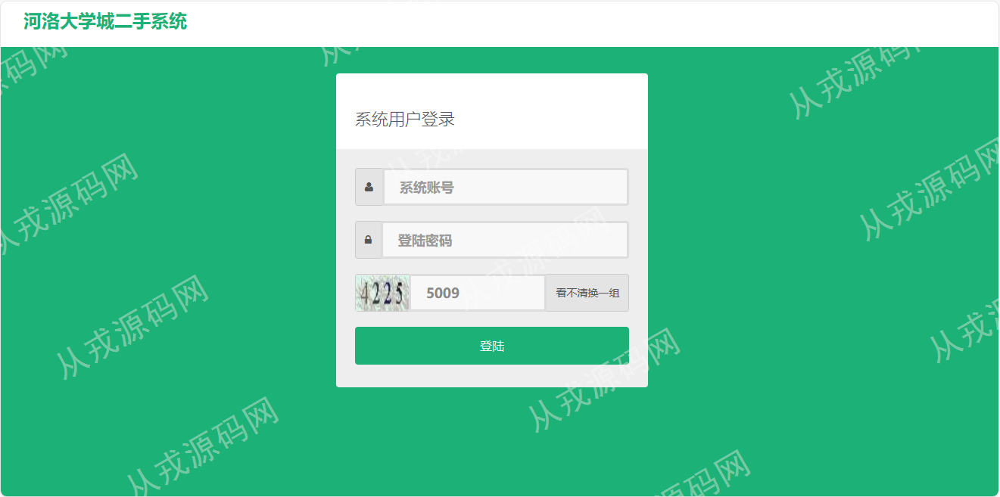
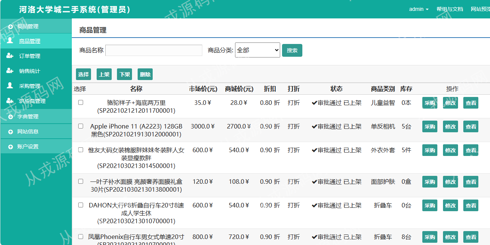

<h1 align="center">67.校园二手交易管理系统</h1>

- <b>完整代码获取地址：从戎源码网 ([https://armycodes.com/](https://armycodes.com/))</b>
- <b>技术探讨、资料分享，请加QQ群：692619798</b> 
- <b>作者微信：19941326836  QQ：952045282</b> 
- <b>承接计算机毕业设计、Java毕业设计、Python毕业设计、深度学习、机器学习</b>
- <b>选题+开题报告+任务书+程序定制+安装调试+论文+答辩ppt 一条龙服务</b>
- <b>所有选题地址 ([https://github.com/YuLin-Coder/AllProjectCatalog](https://github.com/YuLin-Coder/AllProjectCatalog)) </b>

## 项目介绍
基于ssm的校园二手交易管理系统：前端jsp、jquery，后端 springmvc、spring、mybatis，集成商品管理、订单管理、销售管理、采购管理、购物车、在线支付等功能于一体的系统。

## 功能介绍

### 用户

- 基本功能：登录、注册、退出
- 首页：轮播图，主导航栏，商品分类导航，爆款推荐，最新推荐，系统公告，销售排行
- 在线下单：商品列表，商品详情，加入购买，收藏商品，购物车，提交订单，在线支付
- 商品管理：发布商品，我的商品，我的求购信息，发布求购信息，我的订单
- 与我相关：购物订单，我的留言，我收到的消息，我的收藏夹
- 安全中心：密码修改，录入密保问题，我的密保问题
- 账户信息：账户查询，收货地址查看与维护，账户余额查询与充值

### 管理员

- 商品管理：商品信息列表，商品查看、修改和删除，上架，下架，采购
- 订单管理：订单列表查询，订单详情，订单删除
- 销售统计：输入开始时间和结束时间，统计时间区间内的商品订单信息进行汇总统计
- 采购管理：采购记录列表，采购记录查看和删除
- 供应商管理：供应商信息的增删改查
- 字典管理：字典信息的增删改查
- 网站信息：首页轮播图设置，网站导航设置，首页栏目设置，系统公告管理，留言管理，敏感词管理，密保问题设置，友情链接
- 账户设置：后台用户管理，会员管理，密码修改，账户修改

## 环境

- <b>IntelliJ IDEA 2021.3</b>

- <b>Mysql 5.7.26</b>

- <b>Tomcat 7.0.73</b>

- <b>JDK 1.8</b>

## 运行截图

